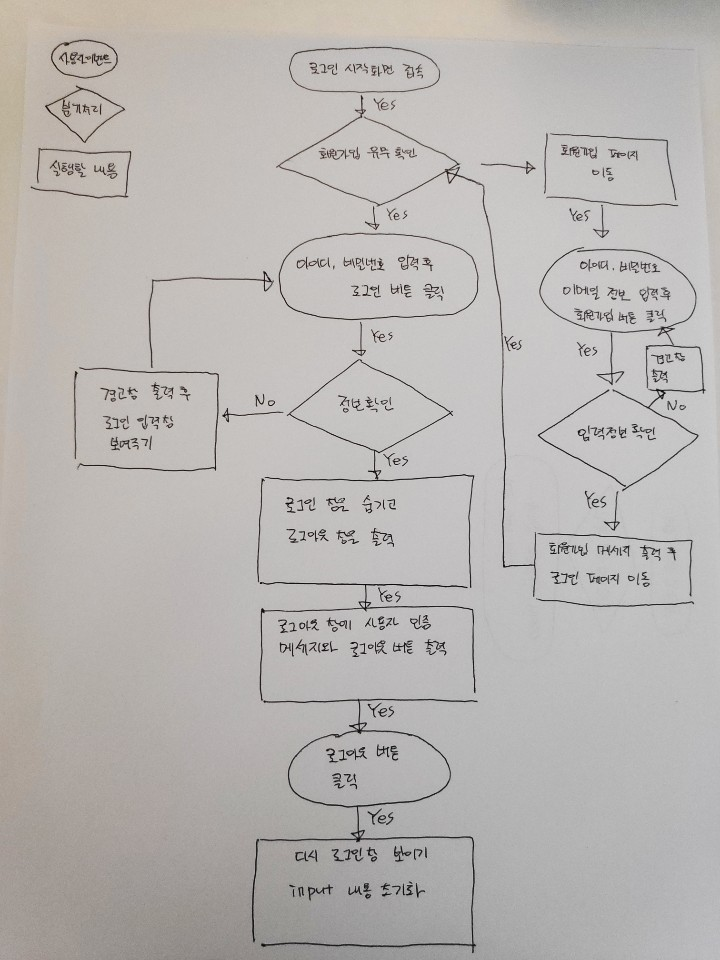

#사용자 인터페이스 대표적인 3가지

* CLI - 명령어 라인 인터페이스 (Command line interface)

* GUI - 그래픽 유저 인터페이스 (Graphic User interface)

* NUI - 자연어 유저 인터페이스 (Natural User interface)

​

# 화면 설계 문서의 종류 3가지

와이어프레임, 스토리보드, 목업

​

# 프로토타입

인터렉션이 포함되어 테스트가 가능한 형태

​

# UI설계서

- 웹 사이트의 페이지 구성요소를 기록한 설계도

- 와이어프레임이나 목업등으로 제작

​

# W3C 웹표준 지침

World Wide Web Consortium의 약자

월드 와이드웹을 위한 표준을 개발하고 장려하는 국제 컨소시엄 조직에서 지정한 표준 가이드 문서

​

# 한국형 웹 콘텐츠 접근성 지침 (KWCAG)에 대해 기술하시오

Korean Web Content Accessibility Guideline의 약자

장애인 비장애인이 동등하게 웹 콘텐츠에 접근할 수 있도록 웹 콘텐츠를 제작하는 방법

​

# 사이트맵의 필요성

네비게이션을 설계하기 위해 사용되며 페이지의 연결관계나 계층구조를 파악하기 위함

​

# 네비게이션

사용자가 사이트에서 원하는 정보를 찾도록 안내하는 메뉴

​

# 유스 케이스(Use Case)

사용자 입장에서 사용자가 원하는 목표를 위하여 시스템에서 수행해야 되는 내용을 기술하는 문서

Use Case | 회원 가입 및 로그인처리| |
|---|:---:|:---:|
개요 | 해당 웹페이지에 로그인하기 위한 과정을 수행
사용자 | 특정 웹페이지에 회원가입된 사용자
선행조건|데이터베이스에 사용자 아이디 "abc", 비번"1234"의 사용자 정보가 있다고 가정

## 사용흐름 

### 기본 
1. 사용자가 로그인 화면에 접속한다.
2. 회원가입 페이지 링크 버튼을 클릭하면 회원가입 페이지로 이동한다.
3. 아이디, 비밀번호, 이메일을 모두 입력하면 회원가입 완료 경고창을 뛰운다.
4. 회원가입완료 경고창 띄운후 바로 로그인화면으로 자동 이동한다.
5. 아이디와 비밀번호를 입력후 login 버튼을 클릭한다.(아이디:"abc", 비번:"1234"고정)
6. 아이디가 "abc", 비밀번호가 "1234"이면 login 박스를 숨기고 logout박스를 출력한다.
7. 로그아웃 박스에는 "사용자님 반갑습니다"라는 메세지와 로그아웃 버튼을 출력한다.
8. 로그아웃 버튼을 클릭하면 다시 lougout박스를 숨기고 login박스를 보여준다.
9. 이때 로그인 박스의 input에 있던 내용들은 비워준다.

### 예외처리

3-1. 만약 입력된 값이 없으면 경고창을 띄워준다.

6-1. 사용자가 입력한 아이디와 비민번호가 "abc", "1234"가 아닐때
6-2. 경고창으로 "아이디와 비밀번호를 다시 확인"하라는 메세지를 띄워준다.
6-3. input에 있던 내용들을 비워주고 그대로 login박스를 화면에 출력한다.

### 기타요구사항

심미성

주 클라이언층이 50대 이상의 중년층이기 때문에 깔끔하게 UI디자인

​

​

# 화면 구현 절차도

유스케이스를 바탕으로 사용자가 접하게 되는 상황을 UI단계별로 도식화해놓은 문서

